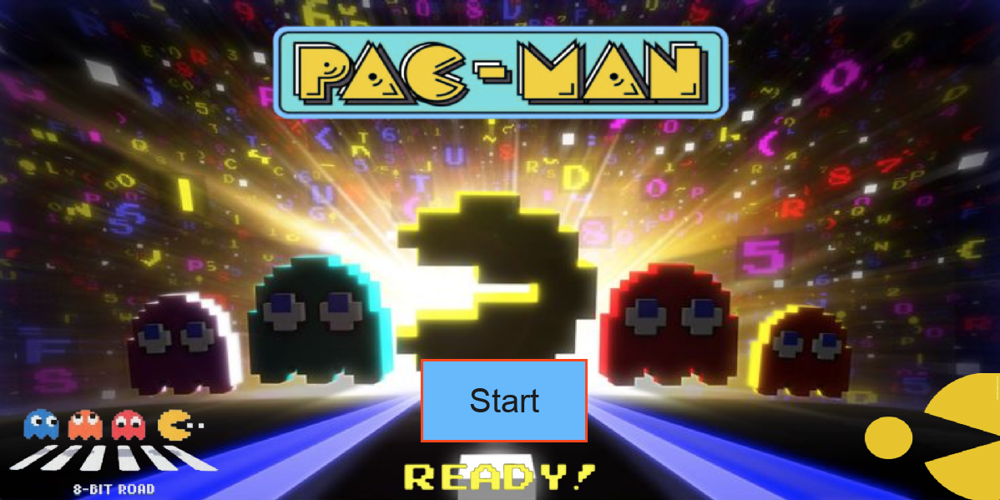
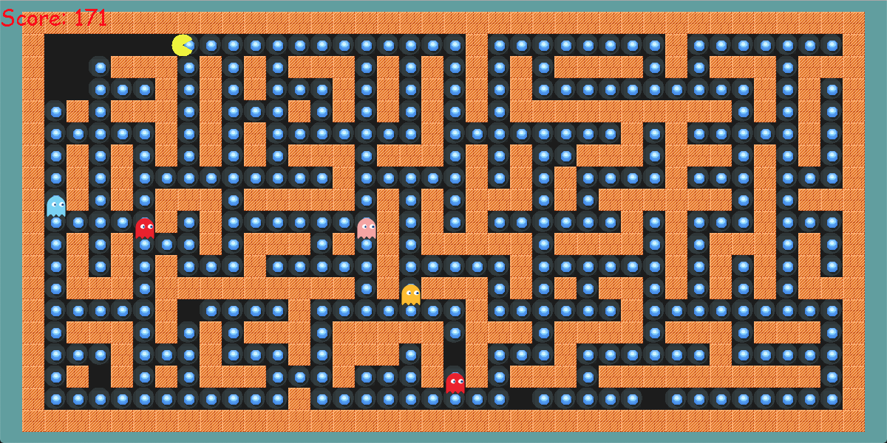
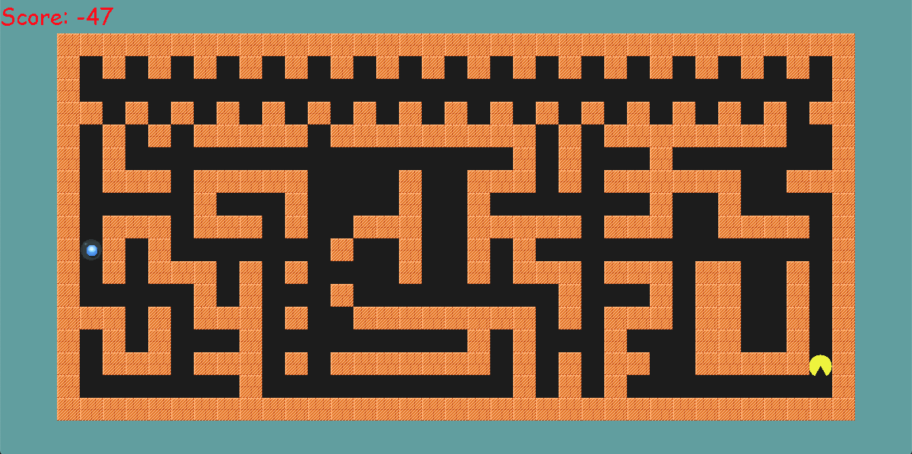

# 🟡 Pacman-AI Game


## 🎯 GIỚI THIỆU TỔNG QUAN

Dự án **Pacman-AI** là một sản phẩm học thuật được thực hiện bởi nhóm 13 trong khuôn khổ môn học **Trí tuệ Nhân tạo** tại Trường Đại học Sư phạm Kỹ thuật TP.HCM. Dự án kế thừa gameplay cổ điển của trò chơi Pacman nhưng thay vì người chơi trực tiếp điều khiển, nhân vật Pacman sẽ được dẫn dắt **tự động hoàn toàn bằng các thuật toán AI** theo từng cấp độ và môi trường khác nhau.



> Không chỉ là một trò chơi giải trí, dự án là một sân chơi học thuật sáng tạo, giúp sinh viên vận dụng lý thuyết vào thực tiễn, trực quan hóa quá trình tìm kiếm và ra quyết định của các thuật toán.

## 🧠 MỤC TIÊU DỰ ÁN

* Triển khai **14 thuật toán AI** theo 7 nhóm lớn để điều khiển Pacman và Ghost.
* Cho phép người dùng tùy chọn **thuật toán** và **bản đồ** để trải nghiệm và đánh giá trực quan.
* Phân chia **4 cấp độ độ khó**, mỗi cấp độ có các đặc trưng AI và độ thử thách riêng.
* So sánh hiệu quả giữa các thuật toán thông qua hành vi của Pacman: tối ưu, nhanh, cẩn thận hay liều lĩnh.
* Hỗ trợ sinh viên học tập, giảng viên trình bày minh họa bài giảng và làm nền tảng cho các nghiên cứu mở rộng.

## 🧩 MÔ HÌNH HOẠT ĐỘNG

Người dùng khởi chạy chương trình → Chọn **Level**, **Thuật toán**, **Bản đồ (.txt)** trong giao diện menu → Quan sát Pacman **tự động chơi** dựa trên thuật toán đã chọn → Kết thúc khi **ăn hết thức ăn** hoặc **bị bắt**.



## 🎮 PHÂN CẤP ĐỘ CHƠI (LEVEL)

| Level | Mô tả gameplay               | Môi trường             | AI Pacman                                                                                                  | AI Ghost             |
|-------|------------------------------|------------------------|------------------------------------------------------------------------------------------------------------|----------------------|
| 1     | Ăn 1 food, không có ghost    | Mê cung tĩnh           | UCS, DFS, BFS, Beam Search, Greedy, Backtracking + Forward Checking, Backtracking + AC3, AndOr, Q-Learning | Không có             |
| 2     | Ăn 1 food, có ghost đứng yên | Ghost thụ động         | BFS, DFS, UCS, Greedy, Beam Search, A*                                                                     | Đứng yên             |
| 3     | Nhiều food, ghost đi quanh   | Ghost tuần tra khu vực | SA Hill Climbing, Simulated Annealing                                                                      | Random theo vùng     |
| 4     | Ghost truy sát thông minh    | Môi trường bất định    | Simulated Annealing, Minimax, Alpha-Beta                                                                   | A* truy đuổi         |

> Các cấp độ được thiết kế tăng dần độ phức tạp, từ dễ dàng (level 1) đến môi trường đối kháng và không chắc chắn (level 4).

## 🧠 CÁC NHÓM THUẬT TOÁN TRIỂN KHAI

### 🔹 Nhóm 1: Tìm kiếm không có thông tin (Uninformed Search)

* **BFS (Breadth-First Search)**
* **DFS (Depth-First Search)**
* **UCS (Uniform Cost Search)**

➡️ Duyệt tuần tự, không cần biết trước đích. Chạy tốt trong môi trường đơn giản như level 1,2.

### 🔹 Nhóm 2: Tìm kiếm có thông tin (Informed Search)

* **A***: `f(n) = g(n) + h(n)`
* **Greedy Search**: chỉ xét `h(n)`
* **Beam Search**: tìm k đường tốt nhất hiện tại

➡️ Chạy nhanh hơn, định hướng đến đích tốt, thích hợp level 2 và ghost level 4.

### 🔹 Nhóm 3: Tìm kiếm cục bộ (Local Search)

* **Steepest-Ascent Hill Climbing**
* **Simulated Annealing**

➡️ Không cần nhớ toàn bộ không gian trạng thái. Có thể mắc kẹt (HC) hoặc vượt qua bẫy local optima (SA).

### 🔹 Nhóm 4: Tìm kiếm trong môi trường phức tạp

* **AND-OR Graph Search**

➡️ Trạng thái sau hành động không chắc chắn, giải bài toán cây AND-OR theo lý thuyết sách giáo khoa.

### 🔹 Nhóm 5: Học tăng cường (Reinforcement Learning)

* **Q-Learning**: chọn hành động tối ưu dựa vào ma trận Q-table đã huấn luyện trước

➡️ Pacman học cách chơi bằng thử-sai, ghi nhớ phần thưởng.

### 🔹 Nhóm 6: Tìm kiếm trong môi trường có ràng buộc (Constraint Satisfaction Search)

* **Backtracking**
* **AC-3 (Arc Consistency 3)**

➡️ Áp dụng cho các bài toán có ràng buộc cứng như: không được đi vào tường, tránh ghost, giới hạn hướng đi,... Sử dụng kỹ thuật loại trừ miền giá trị không hợp lệ và quay lui để tìm lời giải thỏa mãn toàn bộ ràng buộc.

### 🔹 Nhóm 7: Tìm kiếm đối kháng (Adversarial Search)

* **Minimax**
* **Alpha-Beta Pruning**

➡️ Mô phỏng game 2 người. Pacman là Max, Ghost là Min. Sử dụng evaluation function có trọng số để đánh giá.

## 🎬 Minh họa các thuật toán theo 4 cấp độ (Level) và nhóm thuật toán

Tại mỗi cấp độ, các thuật toán được chạy thử thuộc một hoặc nhiều nhóm thuật toán trong tổng số 7 nhóm chính, giúp người dùng dễ quan sát và so sánh hiệu quả từng nhóm trong môi trường cụ thể.


### Level 1 — Mê cung tĩnh, không có ghost

- **Nhóm 1: Tìm kiếm không có thông tin (Uninformed Search)**
  - Uniform Cost Search (UCS)
    
  

  - Depth-First Search (DFS)

  

  - Breadth-First Search (BFS)  
  


- **Nhóm 2: Tìm kiếm có thông tin (Informed Search)**
  - Beam Search
    
  

  - Greedy Search
    
  


- **Nhóm 6: Tìm kiếm trong môi trường có ràng buộc (Constraint Satisfaction Search)**
  - Backtracking + Forward Checking
    
  

  - Backtracking + AC-3
    
  

- **Nhóm 4: Tìm kiếm trong môi trường phức tạp**
  - AND-OR Graph Search
    
  

- **Nhóm 5: Học tăng cường (Reinforcement Learning)**
  - Q-Learning

  

### Level 2 — Có ghost đứng yên

- **Nhóm 1: Tìm kiếm không có thông tin**
  - BFS
    
  

  - DFS
    
  

  - UCS
    
  

- **Nhóm 2: Tìm kiếm có thông tin**
  - Greedy Search
    
  

  - Beam Search
     
  

  - A* Search
    
  


### Level 3 — Ghost tuần tra khu vực

- **Nhóm 3: Tìm kiếm cục bộ (Local Search)**
  - Steepest-Ascent Hill Climbing
    
  


  - Simulated Annealing  

  


### Level 4 — Ghost truy sát thông minh

- **Nhóm 7: Tìm kiếm đối kháng (Adversarial Search)**
  
  - Minimax
    
    

  
  - Alpha-Beta Pruning
    
    


## ⚖️ So sánh điểm số thực tế theo từng cấp độ (Level)

Ta thực hiện chạy thử đồng loạt các thuật toán trong từng level trên cùng một bản đồ mẫu tương ứng và ghi nhận điểm số trung bình Pacman đạt được. Kết quả giúp đánh giá hiệu quả từng nhóm thuật toán trong môi trường đặc thù của mỗi cấp độ.


### Level 1 — Mê cung tĩnh, không có ghost

| Thuật toán                  | Điểm số trung bình | Đặc điểm chính                              |
|----------------------------|--------------------|--------------------------------------------|
| BFS                        | -66             | Tìm đường ngắn, chạy ổn định                |
| DFS                        | -86                | Dễ lạc đường, không hiệu quả                 |
| UCS                        | -66              | Tối ưu chi phí đường đi                       |
| Beam Search                | -66               | Giữ nhiều lựa chọn, nhanh hơn BFS             |
| Greedy Search              | -86               | Nhanh nhưng không luôn tìm được đường tối ưu  |
| Backtracking + AC-3        | -85               | Xử lý ràng buộc tốt, có thể chậm hơn         |
| AND-OR Graph Search        | -96              | Xử lý trạng thái phức tạp                     |
| Q-Learning                 | -96               | Học từ kinh nghiệm, chưa tối ưu ngay          |

---

### Level 2 — Có ghost đứng yên

| Thuật toán                  | Điểm số trung bình | Đặc điểm chính                              |
|----------------------------|--------------------|--------------------------------------------|
| BFS                        | 0               | Chậm và có thể bị ghost bắt                  |
| DFS                        | -4                | Ít hiệu quả, dễ mắc bẫy ghost                  |
| UCS                        | 0               | Tối ưu đường đi, tránh ghost phần nào          |
| Greedy Search              | -4               | Tốt với heuristic đơn giản                    |
| Beam Search                | 0               | Cân bằng giữa tốc độ và hiệu quả               |
| A* Search                  | 0               | Tìm đường nhanh, thông minh tránh ghost        |

---

### Level 3 — Ghost tuần tra khu vực

| Thuật toán                  | Điểm số trung bình | Đặc điểm chính                              |
|----------------------------|--------------------|--------------------------------------------|
| Simulated Annealing        | 207               | Có thể vượt local maxima, tránh ghost hiệu quả  |
| SA Hill Climbing           | 137               | Nhanh nhưng có thể mắc kẹt                      |

---

### Level 4 — Ghost truy sát thông minh

| Thuật toán                  | Điểm số trung bình | Đặc điểm chính                              |
|----------------------------|--------------------|--------------------------------------------|
| Minimax                    | 5157               | Tính đối kháng, rất cẩn thận tránh ghost        |
| Alpha-Beta Pruning         | 5157             | Tối ưu Minimax, nhanh hơn với độ sâu lớn        |

---

## 🧠 HÀM ĐÁNH GIÁ & CHI PHÍ

* **A***: `f(n) = g(n) + h(n)` với `h(n)` là khoảng cách Manhattan đến food.
* **Minimax**:
```python
score = food_count * 100 - ghost_distance * 150
```
* **Hill Climbing**: f(n) = h(n) - số lần đã đi qua ô đó
* **Simulated Annealing**: chấp nhận giải tạm thời tệ hơn dựa vào nhiệt độ T.

## 🖼️ GIAO DIỆN PHẦN MỀM

* Giao diện được xây dựng bằng **Pygame**, có hỗ trợ ảnh nền, nút hover, hiển thị trạng thái Pacman.
* 3 màn hình chính:
  * **Menu**: chọn level, thuật toán, bản đồ
  * **Game**: Pacman di chuyển tự động
  * **Kết thúc**: Thắng/Thua, hiển thị điểm và chọn chơi lại

## 📂 CẤU TRÚC FILE CHÍNH

```
Pacman_AI_Game/
├── Algorithms/       # Các file: BFS.py, AStar.py, Minimax.py...
├── Object/           # Các class: Player, Food, Ghost, Wall...
├── Input/            # Thư mục chứa map chia theo Level
├── Utils/            # File utils.py với các hàm tính toán chung
├── main.py           # Hàm startGame, xử lý thuật toán theo Level
├── constants.py      # Quy định map màu, ký hiệu, thuật toán từng Level
```

## ▶️ HƯỚNG DẪN CHẠY

**Bước 1:** Mở command line và chạy lệnh:

```bash
git clone https://github.com/ThanhSangLouis/Pacman_AI_Game.git
```

**Bước 2:** Bật console **cùng cấp** với file `main.py` (trong thư mục **Source**).

**Bước 3:**

* Nếu đã cài đặt Python và Pygame, bạn có thể bỏ qua bước này.
* Nếu chưa:
  * Tải Python tại: [https://www.python.org/downloads/](https://www.python.org/downloads/)
  * Cài đặt Pygame bằng lệnh:

```bash
pip install pygame
```

* Hoặc cài đặt đầy đủ các thư viện:

```bash
pip install -r requirements.txt
```

**Bước 4:** Chạy chương trình với lệnh:

```bash
python main.py
```

Hoặc nếu dùng Windows:

```bash
py main.py
```

**Lưu ý cho người dùng PyCharm:**

* Mở thư mục chứa cả **Source** và **Input**.
* Mở file `main.py` trong PyCharm và nhấn nút Run ▶️ hoặc tổ hợp phím `Shift + F10` để khởi chạy chương trình.

## 🚀 MỞ RỘNG & ỨNG DỤNG

* Có thể tích hợp thêm thuật toán: Genetic Algorithm, Deep Q-Learning, Policy Gradient ...
* Mở rộng giao diện thêm phần phân tích thống kê: số bước, thời gian, số node mở rộng
* Tạo mode "Học vs Học": Q-Learning Pacman đấu DQN Ghost


## ✍️ TÁC GIẢ

Dự án được thực hiện bởi nhóm sinh viên lớp AI:

- **Lê Văn Chiến Thắng**  
- **Võ Thanh Sang**  
- **Trịnh Nguyễn Hoàng Nguyên**

Trường Đại học Sư phạm Kỹ thuật TP.HCM  
Môn học: Trí tuệ Nhân tạo  
Giảng viên hướng dẫn: TS. Phan Thị Huyền Trang

## 🌐 LINK DỰ ÁN

[🔗 GitHub Repository](https://github.com/ThanhSangLouis/Pacman_AI_Game)

## 📚 TÀI LIỆU THAM KHẢO

[1] Russell, S., & Norvig, P. (2020). *Artificial Intelligence: A Modern Approach* (4th ed.). Pearson.

[2] UC Berkeley AI. (2025, May 13). *Project 2: Multi-Agent Pacman*. UC Berkeley Artificial Intelligence.  
https://ai.berkeley.edu/multiget.html

[3] nxhawk. (2020, September 19). *Pacman-AI*. GitHub.  
https://github.com/nxhawk/Pacman-AI
